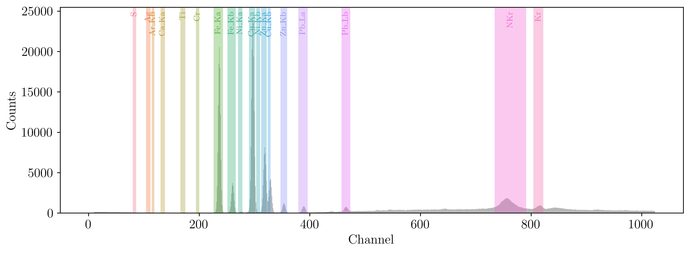
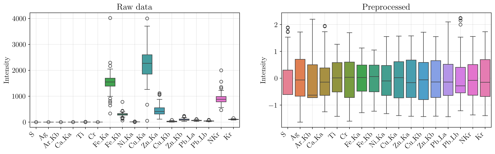
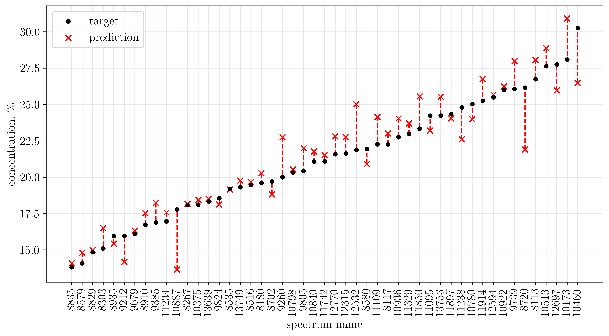

# Определение концентрации меди на основе спектральных данных

## Аннотация

В данной работе исследуется возможность определения концентрации меди (Cu) в образцах на основе данных рентгенофлуоресцентного анализа (XRF). Был разработан конвейер обработки данных, включающий извлечение физически интерпретируемых признаков (интенсивностей спектральных линий) из сырых спектров, статистическую предобработку и обучение линейной модели с L₁-регуляризацией (LASSO). Для настройки модели использовался метод проксимального градиентного спуска и стратифицированная кросс-валидация.

## Введение

Целью работы является построение регрессионной модели $f(S) \to C_{\text{Cu}}$, где $S$ — исходный энергетический спектр, а $C_{\text{Cu}}$ — концентрация меди. Данные представляют собой набор спектров (1024 канала) и соответствующих лабораторных значений концентраций. Сложность задачи обусловлена небольшим исходным набором данных (243 спектра), необходимостью корректного отбора признаков и наличием фона.

## Методология

### Пример исходных данных

### Извлечение признаков

Вместо подачи сырых отсчетов (counts) всех 1024 каналов в модель, был применен подход, основанный на физике процесса. Для каждого химического элемента, определенного в файле `Elements.txt` (S, Ag, Ar, Ca, Ti, Cr, Fe, Ni, Cu, Zn, Pb, Kr), вычислялась интегральная интенсивность пика.

**Алгоритм обработки** (`process_spectra_intensities`):

1. **Определение ROI (Region of Interest):** Для каждой спектральной линии (например, Kα, Kβ, Lα) определены границы каналов [L, R].

2. **Вычитание фона:** Для оценки фона используются интервалы слева и справа от пика. Фон аппроксимируется линейно между средними значениями в левой и правой фоновых областях.

3. **Нормировка на live time:** Полученные чистые площади пиков (net counts) нормируются на время набора спектра (`LIVE_TIME`), преобразуясь в интенсивности (`cps` — counts per second).

Итоговый набор данных состоит из интенсивностей линий различных элементов.

### Предобработка данных

Для улучшения стабильности и качества обучения были применены следующие этапы:

- **Стратифицированное разбиение:** Целевая переменная (концентрация) была дискретизирована на 3 категории (*small, mid, large*) по квантилям 0.35 и 0.70. Разбиение на обучающую (80%) и тестовую (20%) выборки проводилось стратифицированно по этим категориям, чтобы улучшить репрезентативность теста.

- **Логарифмирование целевой переменной:** Для работы с распределением концентраций и уменьшения гетероскедастичности применено преобразование $y' = \ln(y + \varepsilon)$. Логарифмическое преобразование также позволяет избежать отрицательных предсказаний, что было бы неверно для концентраций.

- **Обработка выбросов:** Для признаков (в обучающей выборке) применено ограничение значений (clipping) по 5-му и 95-му перцентилям. Это позволяет снизить влияние аномальных выбросов в спектрах на коэффициенты линейной модели.

- **Стандартизация:** Все признаки приведены к нулевому среднему и единичной дисперсии (`StandardScaler`).

## Моделирование

### Модель LASSO

В качестве предиктивной модели выбрана линейная регрессия с L₁-регуляризацией. Данный выбор обусловлен необходимостью отбора признаков: L₁-штраф зануляет коэффициенты при незначимых элементах, оставляя только те, которые физически коррелируют с содержанием меди.

**Целевая функция минимизации:**

$$\min_{w} \left( \frac{1}{2N} \Vert Xw - y\Vert_2^2 + \alpha \Vert w\Vert_1 \right)$$

### Оптимизация

Для обучения модели был реализован кастомный солвер на основе **проксимального градиентного спуска**:

1. Шаг градиентного спуска по гладкой части функции потерь (MSE).
2. Применение оператора мягкого порога (Soft Thresholding) для учета негладкого L₁-члена:

$$S_\tau(z) = \text{sign}(z) \cdot \max(|z| - \tau, 0)$$

Оптимальный параметр регуляризации $\alpha$ подбирался с помощью стратифицированной кросс-валидации (5 фолдов) на обучающей выборке. Критерием выбора являлась минимизация среднеквадратичной ошибки (MSE) на валидационных фолдах.

## Результаты

### Вклад признаков

Несмотря на ограниченный объем обучающей выборки, распределение весов регрессии демонстрирует, что модель успешно выявила фундаментальные зависимости рентгенофлуоресцентного анализа.

**Ключевые признаки, отобранные LASSO-регуляризацией:**

- **Cu_Ka (+0.149):** Основной предиктор. Положительный вес подтверждает прямую зависимость между интенсивностью характеристической линии и концентрацией элемента.

- **Cu_Kb (0.000):** Вес занулен. Это свидетельствует о корректной работе регуляризатора: линия Kβ жестко коррелирована с Kα и не несет дополнительной информации. Исключение мультиколлинеарности повышает устойчивость модели.

- **Fe_Ka (-0.145):** Значительный отрицательный вес. Данный эффект объясняется физикой взаимодействия излучения с веществом. Энергия фотонов Cu Kα (8.04 кэВ) превышает край поглощения железа Fe K-edge (7.11 кэВ), что приводит к сильному поглощению излучения меди атомами железа. Отрицательный коэффициент в линейной модели компенсирует это явление, занижая видимый сигнал меди при высоком содержании железа.

- **Пики рассеяния NKr (-0.069) и Kr (-0.033):** Отрицательные веса коррелируют с теорией. Интенсивность рассеянного излучения обратно пропорциональна среднему атомному номеру Z образца. Высокая концентрация металлов (Cu, Fe) повышает Z и подавляет рассеяние.

### Итоговые результаты

На отложенной тестовой выборке среднеквадратичная ошибка составила **RMSE = 1.13**

Несмотря на использование стратифицированного разбиения, наблюдаем обратную пропорциональность точности предсказаний от величины концентрации. Такое поведение может быть обусловлено использованием слишком простой модели, недостаточной предобработкой исходных данных, а также небольшой величиной выборки.

## Лицензия MIT

Проект создан в образовательных целях.
